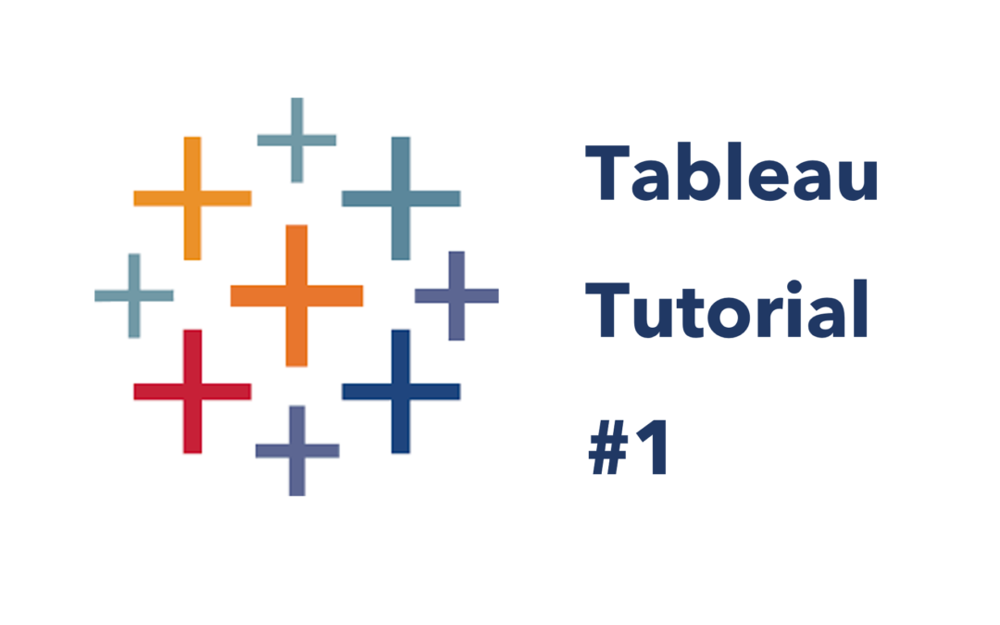
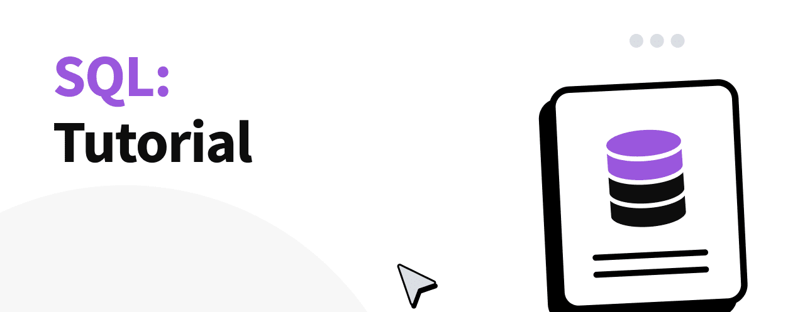

<link rel="stylesheet" href="/assets/css/style.css">
<link rel="stylesheet" href="https://cdnjs.cloudflare.com/ajax/libs/font-awesome/6.4.2/css/all.min.css">

  

    

      
    

    

  <h1>Gowtham K Jayachandiran</h1>
  <h4>Transforming Data into Strategic Success with Cutting-Edge Analytics and Visionary Leadership</h4>
      

        
<i class="fas fa-map-marker-alt"></i> Al Murar, Gold Souq, Dubai, UAE

        
<i class="fas fa-phone"></i> <a href="tel:+971501741840">+971 501741840</a>

        
<i class="fas fa-envelope"></i> <a href="mailto:gowthamkiaya@gmail.com">gowthamkjaya@gmail.com</a>

        
<i class="fab fa-linkedin"></i> <a href="https://www.linkedin.com/in/gowtham-kumar/">LinkedIn</a>

        
<i class="fas fa-file-pdf"></i> <a href="/assets/Gowtham_Jayachandiran_Resume.pdf">Download Resume (PDF)</a>

      

    

  

---

## ✨ Executive Summary

**Business Intelligence** and **Data Science leader** with over **10 years of experience** driving **digital transformation**, **actionable insights**, and **strategic growth** in **Fintech**, **Retail** and **Technology sectors**.

Excel at designing **Dynamic Dashboards**, **ML/AI Model Development & Deployment**, **Optimizing Data Pipelines** and **Leading Cross-Functional** teams to align with global business objectives. 

At Nomura and Cisco, I spearheaded **BI and AI/ML initiatives**, delivering significant revenue growth and operational efficiencies. Certified in **Power BI, Tableau, Excel, SQL & Alteryx**, Equipped to elevate data-driven decision-making and commercial excellence.

- 🧠 Developed & Deployed production scale **RAG AI Streamlit** app using GPT-3.0 Turbo, Langchain, enhancing **Tableau Dashboard** adoption and boosting **user interaction** efficiency by **25%**.
- ✅ Developed **35+ Power BI** & **Tableau** dashboards, improving usage by **15%**, adopted by **3,000+ stakeholders** across Nomura & Cisco.
- 🤖 Optimized **SQL queries** on **Snowflake**, reducing analytics runtime by **80%**, from 5 minutes to 45 seconds, enhancing decision-making.
- 💰 Drove **$700K+** in pipeline opportunities via **ML-based customer segmentation**, delivering **78+ cross-sell** insights at Cisco.
- 📈 Delivered **C-suite** PowerPoint presentations, aligning **market trends** and **sales insights** for **10%** revenue growth across regions.
- 👨‍🏫 Trained **4,500+** professionals globally, achieving **70%+** adoption of **BI tools**, boosting **digital literacy** and collaboration.
- 🔒 Ensured **0%** error rate in automated reports and **GDPR/CCPA** compliance, implementing **RBAC** and data masking for **100M+** records.

  Microsoft Certified: Power BI Data Analyst Associate
  Tableau Desktop Specialist Certification
  Alteryx Designer Core Certification
  Microsoft Office Specialist – Excel Expert
  HackerRank SQL Intermediate – Gold Medal

---

## 🛠️ Technical Skills

  

    <h3><i class="fas fa-chart-pie"></i> BI Tools</h3>
    

      <i class="fas fa-chart-bar"></i> Power BI Desktop
      <i class="fas fa-globe"></i> Power BI Online
      <i class="fas fa-desktop"></i> Tableau Desktop
      <i class="fas fa-server"></i> Tableau Server
      <i class="fas fa-share-alt"></i> Tableau Public
    

  

  
  

    <h3><i class="fas fa-database"></i> ETL Tools</h3>
    

      <i class="fas fa-cogs"></i> Alteryx Designer
      <i class="fas fa-filter"></i> Power Query Editor
      <i class="fas fa-clipboard-check"></i> Tableau Prep
      <i class="fas fa-exchange-alt"></i> SSIS
    

  

  
  

    <h3><i class="fas fa-code"></i> Programming</h3>
    

      <i class="fab fa-python"></i> Advanced Python
      <i class="fas fa-fire"></i> PyTorch
      <i class="fas fa-brain"></i> Scikit-Learn
      <i class="fas fa-link"></i> LangChain
      <i class="fas fa-comment-alt"></i> Llama
      <i class="fas fa-stream"></i> Streamlit
    

  

  
  

    <h3><i class="fas fa-database"></i> Databases</h3>
    

      <i class="fas fa-database"></i> MySQL
      <i class="fas fa-snowflake"></i> Snowflake
      <i class="fas fa-code"></i> T-SQL
    

  

  
  

    <h3><i class="fas fa-cloud"></i> Cloud</h3>
    

      <i class="fab fa-microsoft"></i> Azure Data Factory
      <i class="fas fa-project-diagram"></i> Denodo
      <i class="fab fa-google"></i> Vertex AI
    

  

  
  

    <h3><i class="fas fa-robot"></i> AI/ML Tools</h3>
    

      <i class="fab fa-microsoft"></i> Azure Machine Learning Studio
      <i class="fas fa-snowflake"></i> Snowflake Cortex AI
      <i class="fas fa-comment-dots"></i> HuggingFace Transformers - LLM
    

  

  
  

    <h3><i class="fas fa-tools"></i> Other</h3>
    

      <i class="fab fa-docker"></i> Docker
      <i class="fab fa-jira"></i> JIRA
      <i class="fas fa-file-excel"></i> Microsoft Excel
      <i class="fas fa-file-powerpoint"></i> Microsoft PowerPoint
      <i class="fas fa-sitemap"></i> SharePoint Web Pages
      <i class="fab fa-confluence"></i> Confluence
    

  

---

# 📊 My Portfolio

<!-- Left Column - YouTube Tutorials -->

  

    <h2>📹 YouTube Tutorials</h2>
  

  

    <!-- YouTube Video Entry Example -->
    

      

        
        
▶️

      

      

        <h3>Excel Tutorials - Beginner to Intermediate</h3>
        
Contains 4-hour detailed explanation of basic functions and formula

        

          👁️ 1.2K views
          ⏱️ 04:15:24
        

        <a href="https://www.youtube.com/watch?v=j_IunrORQZ0&list=PLlEyMvUZ31GAJzVplMliIsoRsgoF90B-M" style="display: inline-block; padding: 8px 16px; background-color: #159957; color: white; text-decoration: none; border-radius: 4px; font-weight: 500;">Watch Tutorial</a>
      

    

    
    <!-- Another YouTube Video Entry -->
    

      

        
        
▶️

      

      

        <h3>Tableau - Beginner to Intermediate</h3>
        
14-hour videos which contains how to get started with Tableau and all the way till building a report independently

        

          👁️ 3.5K views
          ⏱️ 14:15:47
        

        <a href="https://www.youtube.com/watch?v=aS7NtoFXVg4&list=PLlEyMvUZ31GDBzJEQEiT4mwQ2HoEEMzK4" style="display: inline-block; padding: 8px 16px; background-color: #159957; color: white; text-decoration: none; border-radius: 4px; font-weight: 500;">Watch Tutorial</a>
      

    

    
    <!-- Another YouTube Video Entry -->
    

      

        
        
▶️

      

      

        <h3>SQL Tutorial - Joins & Sub-Queries</h3>
        
Contains 4-hour detailed explanation of MySQL JOINS and SUBQUERIES

        

          👁️ 2.7K views
          ⏱️ 4:07:17
        

        <a href="https://www.youtube.com/watch?v=8P4bjjpTDJg&list=PLlEyMvUZ31GAwPLDcTQfjEtyuZjL-Dctx" style="display: inline-block; padding: 8px 16px; background-color: #159957; color: white; text-decoration: none; border-radius: 4px; font-weight: 500;">Watch Tutorial</a>
      

    

    <!-- Another YouTube Video Entry -->
    

      

        
        
▶️

      

      

        <h3>Alteryx Tutorial - Beginner to Intermediate</h3>
        
14-hour videos which contains how to get started with Tableau and all the way till building a report independently

        

          👁️ 3.5K views
          ⏱️ 04:23:32
        

        <a href="https://www.youtube.com/watch?v=EH8ohIA2KHc" style="display: inline-block; padding: 8px 16px; background-color: #159957; color: white; text-decoration: none; border-radius: 4px; font-weight: 500;">Watch Tutorial</a>
      

    

  

<!-- Right Column - External Links -->

  

    <h2>🔗 External Projects</h2>
  

  

    <!-- GitHub Project -->
    

      

        <svg viewBox="0 0 24 24" width="40" height="40">
          <path fill="#159957" d="M12 .297c-6.63 0-12 5.373-12 12 0 5.303 3.438 9.8 8.205 11.385.6.113.82-.258.82-.577 0-.285-.01-1.04-.015-2.04-3.338.724-4.042-1.61-4.042-1.61C4.422 18.07 3.633 17.7 3.633 17.7c-1.087-.744.084-.729.084-.729 1.205.084 1.838 1.236 1.838 1.236 1.07 1.835 2.809 1.305 3.495.998.108-.776.417-1.305.76-1.605-2.665-.3-5.466-1.332-5.466-5.93 0-1.31.465-2.38 1.235-3.22-.135-.303-.54-1.523.105-3.176 0 0 1.005-.322 3.3 1.23.96-.267 1.98-.399 3-.405 1.02.006 2.04.138 3 .405 2.28-1.552 3.285-1.23 3.285-1.23.645 1.653.24 2.873.12 3.176.765.84 1.23 1.91 1.23 3.22 0 4.61-2.805 5.625-5.475 5.92.42.36.81 1.096.81 2.22 0 1.606-.015 2.896-.015 3.286 0 .315.21.69.825.57C20.565 22.092 24 17.592 24 12.297c0-6.627-5.373-12-12-12"/>
        </svg>
      

      

        <h3>Tableau Descriptive & Predictive Dashboard</h3>
        
Detailed breakdown of visuals representing both descriptive & predictive metrics on Sample Superstore dataset

        

          ⭐ 1000+ views
          🔄 Built in 2019
        

        <a href="https://public.tableau.com/app/profile/gowtham.kumar.jayachandiran/viz/DescriptivePredictiveAnalysis-SuperstoreSales/TitleDB" style="display: inline-block; padding: 8px 16px; background-color: #159957; color: white; text-decoration: none; border-radius: 4px; font-weight: 500;">View Dashboard</a>
      

    

    
    <!-- Streamlit App -->
    

      

        <svg viewBox="0 0 24 24" width="40" height="40">
          <path fill="#159957" d="M16.53 9.78c.6.079.62.737.47.737H7.05c-.627 0-.66-.665-.473-.736.495-.181 1.016-.279 1.558-.279h6.84c.548 0 1.075.1 1.556.278zM3.6 12.12s-.48.982 1.182 1.07h14.735c1.172-.088 1.087-1.059 1.087-1.059a7.37 7.37 0 0 0-.361-1.382c-.32-.868-1.044-1.428-1.875-1.428H6.082c-.831 0-1.556.56-1.875 1.428a7.417 7.417 0 0 0-.607 2.371zm1.188 2.708s-.453.934 1.155 1.02h12.564c1.145-.086 1.064-1.02 1.064-1.02a7.05 7.05 0 0 0-.361-1.315c-.319-.826-1.042-1.358-1.881-1.358H7.03c-.839 0-1.561.532-1.88 1.358a7.1 7.1 0 0 0-.361 1.315z"/>
        </svg>
      

      

        <h3>Streamlit Application</h3>
        
Interactive data visualization web application built with Streamlit.

        

          👁️ 2.8K views
          🚀 Live Demo
        

        <a href="#" style="display: inline-block; padding: 8px 16px; background-color: #159957; color: white; text-decoration: none; border-radius: 4px; font-weight: 500;">Try Application</a>
      

    

    
    <!-- Personal Website -->
    

      

        <svg viewBox="0 0 24 24" width="40" height="40">
          <path fill="#159957" d="M12 2C6.486 2 2 6.486 2 12s4.486 10 10 10 10-4.486 10-10S17.514 2 12 2zm7.931 9h-2.764a14.67 14.67 0 0 0-.496-2.995c.513-.23 1.011-.496 1.487-.806a8.007 8.007 0 0 1 1.773 3.801zM12 4c.791 0 1.651.378 2.501 1.158.579.533 1.113 1.248 1.584 2.102-.468.092-.96.176-1.476.242C13.949 7.156 13.048 7 12 7s-1.949.156-2.61.5c-.511-.065-1.005-.15-1.476-.242.471-.854 1.005-1.569 1.584-2.102C10.349 4.378 11.21 4 12 4zm-3.509 1.193c-.24.212-.464.433-.671.661C7.39 6.33 7.015 6.839 6.674 7.4c-.254.424-.48.873-.674 1.325A13.64 13.64 0 0 1 4.069 11H4c-.298 0-.595-.013-.883-.039A7.963 7.963 0 0 1 6.889 5.21c.532.311 1.03.577 1.542.807.204.09.414.173.631.249a13.917 13.917 0 0 0-.571.927zM4.069 13h2.764c.081 1.036.229 2.039.493 2.995-.508.227-1.001.492-1.472.799A8.007 8.007 0 0 1 4.069 13zM12 20c-.79 0-1.644-.375-2.489-1.144-.581-.532-1.112-1.242-1.584-2.087.483-.095.96-.181 1.476-.246.66.347 1.562.501 2.597.501s1.938-.154 2.597-.501c.516.065 1.003.156 1.476.246-.472.845-1.003 1.555-1.584 2.087C13.644 19.625 12.79 20 12 20zm3.254-1.893c.477-.307.97-.572 1.478-.799.264-.956.412-1.959.493-2.995h2.764a8.007 8.007 0 0 1-1.773 3.799c-.471-.298-.964-.562-1.472-.788a11.81 11.81 0 0 0-.63-.249c.208-.294.403-.603.571-.926.169-.323.32-.666.456-1.022l-1.887.982zm4.671-8.046A7.963 7.963 0 0 1 20.883 11h-.014c-.298 0-.595.013-.883.039a14.118 14.118 0 0 0-.493-2.995c.513-.23 1.011-.496 1.487-.806z"/>
        </svg>
      

      

        <h3>Power BI Headcount Dashboard</h3>
        
Headcount dashboard containing all key metrics & KPI's about retention, attrition, etc.,

        

          🛠️ Power BI Desktop, Power Query Editor
          🔄 Built in 2021
        

        <a href="#" style="display: inline-block; padding: 8px 16px; background-color: #159957; color: white; text-decoration: none; border-radius: 4px; font-weight: 500;">Visit Website</a>
      

    

    
    <!-- Another Streamlit App -->
    

      

        <svg viewBox="0 0 24 24" width="40" height="40">
          <path fill="#159957" d="M16.53 9.78c.6.079.62.737.47.737H7.05c-.627 0-.66-.665-.473-.736.495-.181 1.016-.279 1.558-.279h6.84c.548 0 1.075.1 1.556.278zM3.6 12.12s-.48.982 1.182 1.07h14.735c1.172-.088 1.087-1.059 1.087-1.059a7.37 7.37 0 0 0-.361-1.382c-.32-.868-1.044-1.428-1.875-1.428H6.082c-.831 0-1.556.56-1.875 1.428a7.417 7.417 0 0 0-.607 2.371zm1.188 2.708s-.453.934 1.155 1.02h12.564c1.145-.086 1.064-1.02 1.064-1.02a7.05 7.05 0 0 0-.361-1.315c-.319-.826-1.042-1.358-1.881-1.358H7.03c-.839 0-1.561.532-1.88 1.358a7.1 7.1 0 0 0-.361 1.315z"/>
        </svg>
      

      

        <h3>Streamlit Application</h3>
        
Interactive data visualization web application built with Streamlit.

        

          👁️ 2.8K views
          🚀 Live Demo
        

        <a href="#" style="display: inline-block; padding: 8px 16px; background-color: #159957; color: white; text-decoration: none; border-radius: 4px; font-weight: 500;">Try Application</a>
      

    

  

---

## 🧠 Core Competencies

  

    <i class="fas fa-brain"></i> AI/ML Model Development & Deployment
  

  

    <i class="fas fa-chart-line"></i> Commercial Analytics
  

  

    <i class="fas fa-shield-alt"></i> Compliance & Security
  

  

    <i class="fas fa-brain"></i> Machine Learning & Deep Learning
  

  

    <i class="fas fa-users"></i> Cross-Functional Leadership
  

  

    <i class="fas fa-chart-bar"></i> Data Analysis & Visualization
  

  

    <i class="fas fa-check-circle"></i> Data Integrity & Standardization
  

  

    <i class="fas fa-database"></i> Data Pipeline Architecture & ETL Integration
  

  

    <i class="fas fa-digital-tachograph"></i> Digital Transformation
  

  

    <i class="fas fa-tasks"></i> Project Management
  

  

    <i class="fas fa-shopping-cart"></i> Retail Analytics & Customer Experience
  

  

    <i class="fas fa-lightbulb"></i> Sales Insights & Analytics
  

  

    <i class="fas fa-comment-dots"></i> Storytelling with Data
  

  

    <i class="fas fa-chart-bar"></i> Business Intelligence
  

  

    <i class="fas fa-arrow-trend-up"></i> Strategic Growth
  

  

    <i class="fas fa-user-tie"></i> Team Leadership & Mentorship
  

---

# 💼 Professional Experience

## <i class="fas fa-network-wired"></i> Cisco — Data Scientist & BI Specialist, Global Office of Analytics
### Apr 2023 – Present | Bengaluru, India

Snowflake, Streamlit, Python, Tableau, Power BI, Salesforce CRM Analytics, Azure

- <i class="fas fa-robot"></i> Lead **3 direct reports**, developing **AI/ML** pipelines and a **GenAI Assistant** using **Llama** and **GPT-4 Turbo**, boosting **Tableau dashboard** adoption by **15%+** for **300+** users in one month.
- <i class="fas fa-users-cog"></i> Built **customer segmentation** models on **telemetry data**, delivering **78+ cross-sell** opportunities, adding **$700K** to the pipeline for sales effectiveness.
- <i class="fas fa-chart-bar"></i> Architected interactive **Power BI** dashboards, adopted by **14 executives** for quarterly reviews, enhancing sales **KPI tracking** and strategic alignment.

&nbsp;

## <i class="fas fa-landmark"></i> Nomura — Assistant Vice President, Business Intelligence
### Jul 2021 – Feb 2023 | Bengaluru, India

SQL, Snowflake, Python, Power BI, Tableau, Alteryx, Azure

- <i class="fas fa-dollar-sign"></i> Directed a **RAD team** of **7 BI analysts**, delivering **35+ Power BI**, **Tableau**, and **Alteryx** dashboards to track trader performance, improving sales metrics by **15%** for **3,000+** stakeholders.
- <i class="fas fa-tachometer-alt"></i> Optimized SQL queries on **Snowflake**, reducing trade **PnL analytics** runtime by **80%**, from **5 minutes to 45 seconds**, enabling real-time insights.
- <i class="fas fa-chalkboard-teacher"></i> Presented data-driven market insights to **C-suite**, driving **10%** revenue growth through strategic recommendations.

&nbsp;

## <i class="fas fa-university"></i> State Street — Data Scientist, Global CoE
### Apr 2019 – Jul 2021 | Bengaluru, India

SQL, Essbase, AWS, Snowflake, Tableau, Python, Excel

- <i class="fas fa-file-alt"></i> Developed **Client PnL** dashboards using **Essbase**, **AWS**, and **Snowflake**, improving financial reporting accuracy for sales and **compliance stakeholders**.
- <i class="fas fa-cogs"></i> Built **predictive segmentation** models on **ICAMS** data, resolving **18%** of **operational issues**, optimizing sales processes.
- <i class="fas fa-users"></i> Collaborated with cross-functional teams to integrate **data pipelines**, **automating reporting** workflows for decision-making efficiency.

&nbsp;

## <i class="fas fa-chart-pie"></i> Kantar Group (Analytics Quotient) — Business Analyst
### Sep 2018 – Mar 2019 | Bengaluru, India

Tableau, SQL, Excel, Power BI, Python

- <i class="fas fa-chart-line"></i> Created **3 interactive Tableau dashboards**, enhancing retail **sales insights** and **stakeholder communication** for strategic decision-making.
- <i class="fas fa-shield-alt"></i> Standardized **GDPR/CCPA-compliant** reports, achieving **0%** project failure rate through rigorous **data integrity** protocols.
- <i class="fas fa-search"></i> Conducted **risk assessments**, delivering data-driven recommendations to **optimize retail** analytics processes.

&nbsp;

## <i class="fas fa-search-dollar"></i> Search2Hired Online Services — Business Analyst
### Apr 2015 – Aug 2018 | Bengaluru, India

SQL, Excel, Python, Tableau, Power Query

- <i class="fas fa-file-excel"></i> Delivered **50+ quarterly dashboards** and reports with **0% error rate**, driving **95% client renewal rates** in e-commerce and finance sectors.
- <i class="fas fa-users"></i> Collaborated with **cross-functional** teams to develop **data-driven** sales tools, optimizing business processes and **customer insights**.
- <i class="fas fa-clock"></i> Automated reporting workflows using **Excel** and **SQL**, saving **20 hours** weekly for stakeholder teams.

---

# 📚 Academic Journey

## 🎓 Education

  

    
🏆

    

      <h3>Master of Technology</h3>
      
<strong>Anna University</strong>, Chennai, India | 2013–2015

      

        7.8 CGPA
        

          

        

      

      
"The foundation for innovation and advanced problem-solving"

    

  

  
  

    
🚀

    

      <h3>Bachelor of Technology</h3>
      
<strong>Anna University</strong>, Chennai, India | 2009–2013

      

        7.3 CGPA
        

          

        

      

      
"Where the technical journey began"

    

  

---

## 🏅 Certifications

  <a href="https://www.credly.com/badges/2602290b-f99d-4608-a6f0-bf7f57fcf8e9/linked_in_profile" target="_blank" class="certification-card">
    
<i class="fab fa-microsoft"></i>

    

      <h3>Microsoft Certified</h3>
      
Power BI Data Analyst Associate

    

    
<i class="fas fa-external-link-alt"></i>

  </a>
  
  <a href="https://www.credly.com/badges/360f9ade-b276-43c8-a055-d1bf10e7a40c/linked_in_profile" target="_blank" class="certification-card">
    
<i class="fas fa-chart-bar"></i>

    

      <h3>Tableau</h3>
      
Desktop Specialist

    

    
<i class="fas fa-external-link-alt"></i>

  </a>
  
  <a href="https://www.credly.com/badges/bff0570b-30ab-41ec-8e34-680d5ff0ef48?source=linked_in_profile" target="_blank" class="certification-card">
    
<i class="fas fa-cogs"></i>

    

      <h3>Alteryx</h3>
      
Designer Core Certification

    

    
<i class="fas fa-external-link-alt"></i>

  </a>
  
  <a href="https://portal.certiport.com/Portal/Pages/PrintTranscriptInfo.aspx?action=Cert&id=417&cvid=iSZInhczAUkSdUt5EYeF0A==" target="_blank" class="certification-card">
    
<i class="fas fa-file-excel"></i>

    

      <h3>Microsoft Office Specialist</h3>
      
Excel Expert

    

    
<i class="fas fa-external-link-alt"></i>

  </a>

---

<footer>
  
<i class="fas fa-clock"></i> Last Updated: April 2025 | Icons by <a href="https://flaticon.com">Flaticon</a>

</footer>
